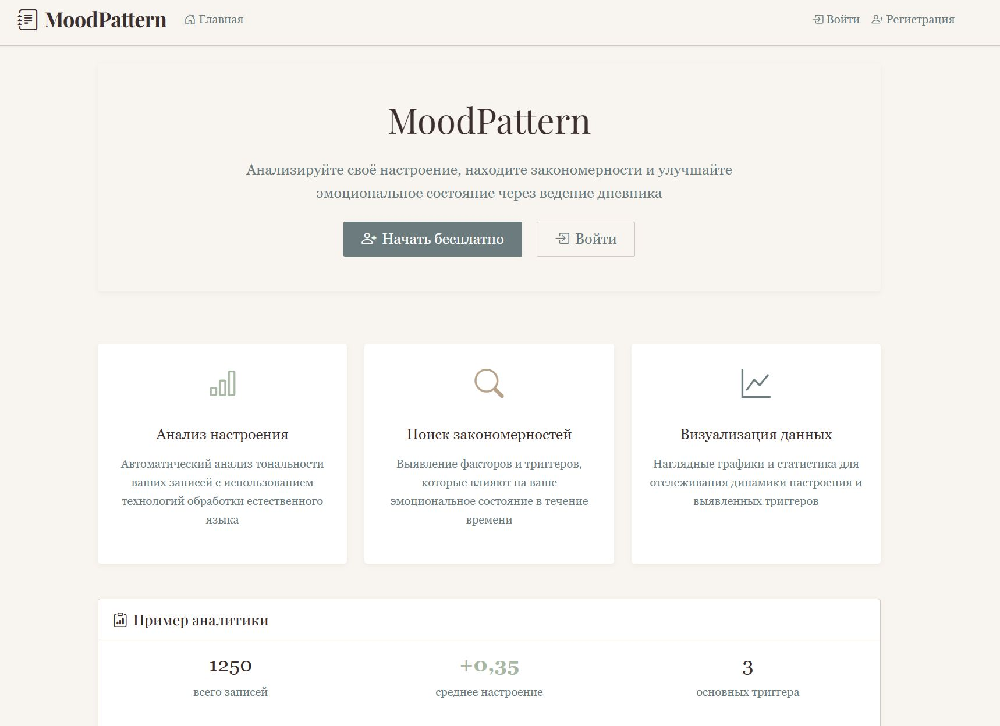
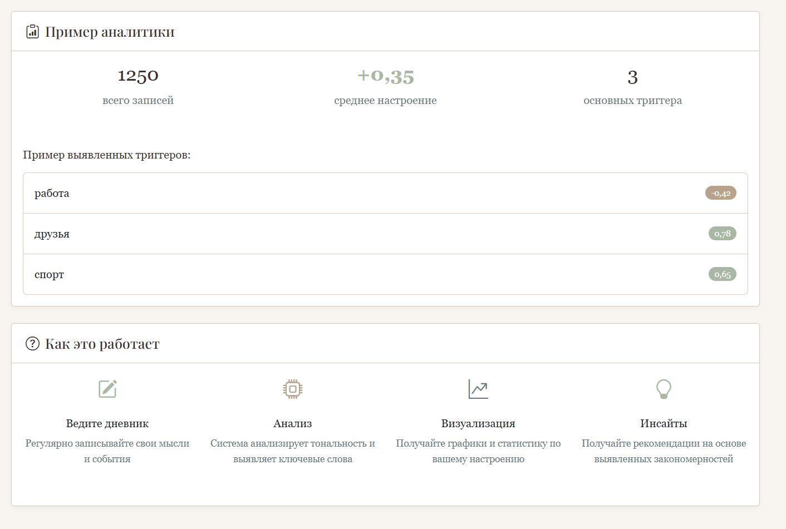
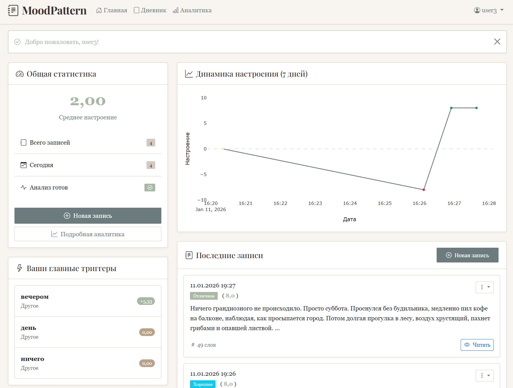
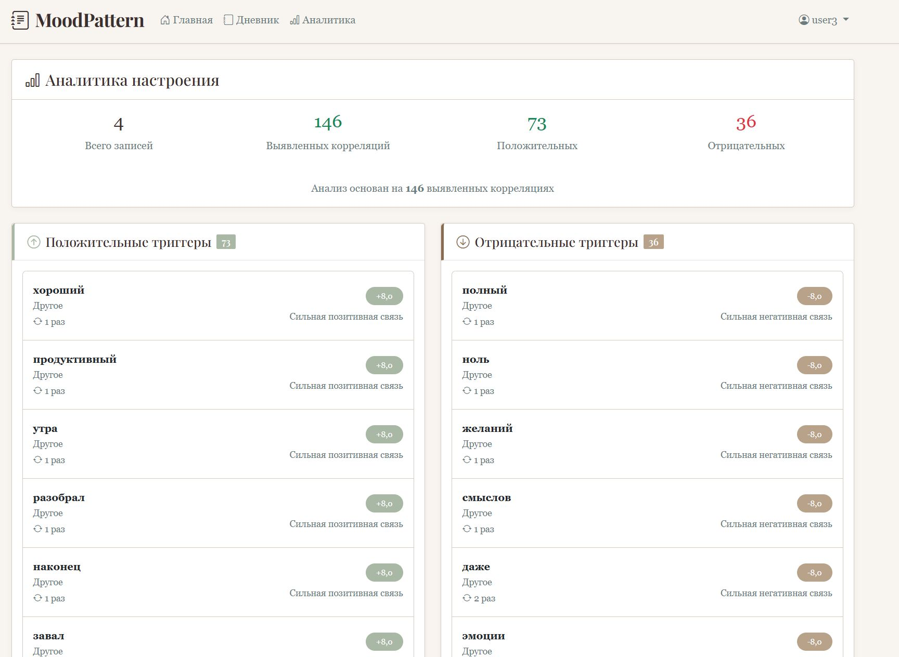
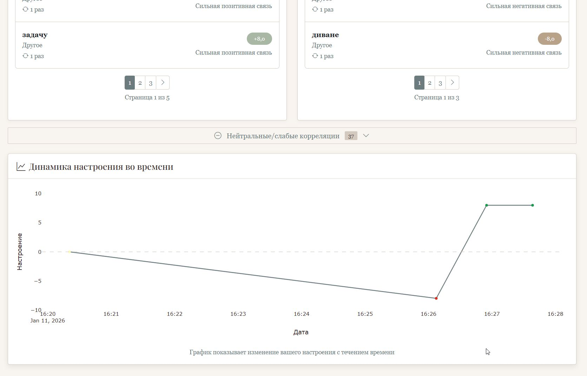
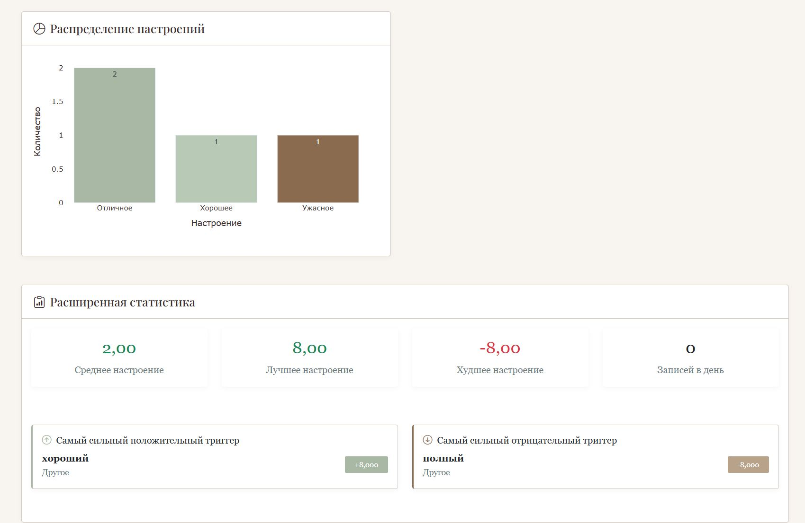
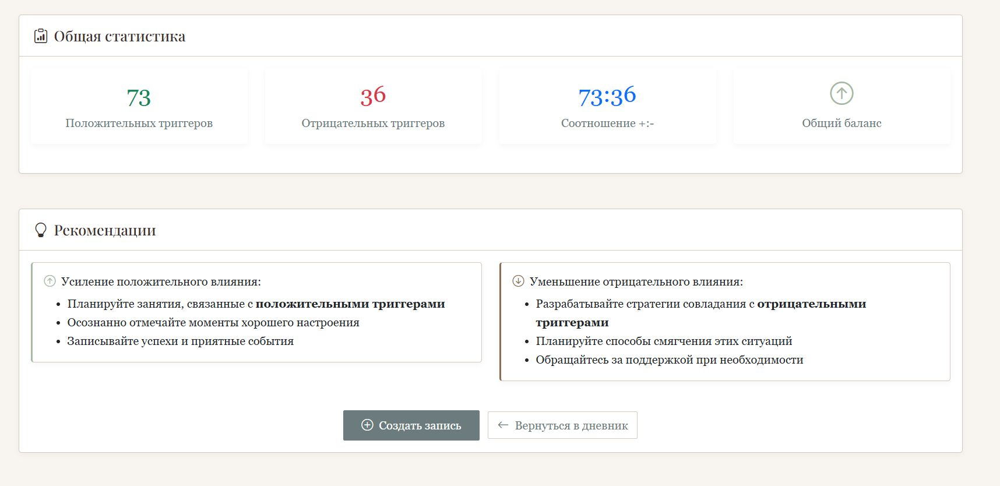
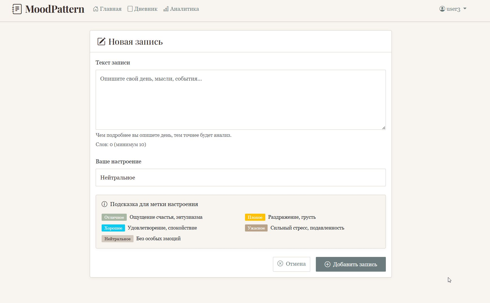
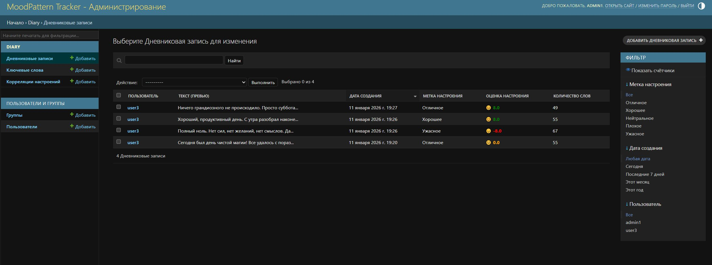

# MoodPattern Tracker

**Умный дневник настроения с анализом эмоциональных триггеров**

MoodPattern Tracker — это веб-приложение для отслеживания настроения через текстовые записи с автоматическим анализом тональности и выявлением факторов, влияющих на эмоциональное состояние. Сервис помогает понять, какие события, люди или занятия делают вас счастливее или огорчают, через визуализацию данных и персонализированные рекомендации.

**Ссылка на рабочий проект:** https://moodpattern-tracker-production.up.railway.app

## Ключевые возможности

- **Умное ведение дневника** — создавайте записи о своем дне, а система автоматически анализирует тональность текста
- **Визуализация настроения** — графики динамики настроения, распределение по дням недели и категориям
- **Выявление триггеров** — алгоритм находит корреляции между темами записей и вашим настроением
- **Аналитика и статистика** — подробная статистика, лучшие/худшие дни недели, сильнейшие триггеры
- **Персональный доступ** — все данные приватны и доступны только вам

## Технологии

### Backend
- **Python 3.10+** — основной язык программирования
- **Django 4.2** — веб-фреймворк
- **SQLite** — база данных для разработки

### Аналитика данных
- **Pandas** — обработка и анализ данных
- **Plotly** — интерактивная визуализация графиков
- **TextBlob/NLTK** — анализ тональности текста
- **Собственный русскоязычный анализатор** — продвинутый анализ русских текстов

### Frontend
- **Bootstrap 5** — адаптивный и современный интерфейс
- **HTML5/CSS3** — верстка с кастомными CSS-переменными
- **JavaScript** — интерактивные элементы интерфейса

### Инструменты разработки
- **Git** — контроль версий
- **dotenv** — управление переменными окружения
- **PEP 8** — стиль кодирования

## Скриншоты

### Главная страница


*Приветственная страница с демонстрацией возможностей сервиса*

### Личный кабинет с аналитикой
!
*Панель управления с последними записями и графиком настроения*

### Детальная аналитика триггеров




*Положительные и отрицательные триггеры настроения с пагинацией*

### Создание записи

*Форма для добавления новой записи с выбором настроения*

### Админ-панель

*Расширенная административная панель для управления данными*

## Как запустить проект локально

### 1. Клонируйте репозиторий
```bash
git clone https://github.com/LutiyKamen/moodpattern_tracker.git
cd moodpattern_tracker
```

### 2. Создайте и активируйте виртуальное окружение
```bash
python -m venv venv

# Для Windows:
venv\Scripts\activate

# Для Linux/Mac:
source venv/bin/activate
```

### 3. Установите зависимости
```bash
pip install -r requirements.txt
```

### 4. Настройте переменные окружения
Создайте файл `.env` в корневой директории проекта:
```env
DJANGO_SECRET_KEY=ваш_секретный_ключ_здесь
DEBUG=True
```

### 5. Выполните миграции
```bash
python manage.py makemigrations
python manage.py migrate
```

### 6. Создайте суперпользователя (опционально)
```bash
python manage.py createsuperuser
```

### 7. Запустите сервер разработки
```bash
python manage.py runserver
```

### 8. Откройте в браузере
Перейдите по адресу: [http://127.0.0.1:8000/](http://127.0.0.1:8000/)

## Структура проекта
```
moodpattern_tracker/
├── diary/                          # Основное приложение
│   ├── models.py                  # Модели данных
│   ├── views.py                   # Контроллеры
│   ├── urls.py                    # Маршруты
│   ├── forms.py                   # Формы Django
│   ├── admin.py                   # Настройки админки
│   ├── signals.py                 # Сигналы для обработки записей
│   ├── analysis_utils.py          # Утилиты анализа данных
│   ├── russian_sentiment.py       # Русскоязычный анализатор
│   └── sentiment_data/            # Словари для анализа
├── templates/diary/               # HTML шаблоны
├── static/                        # Статические файлы
├── media/                         # Загружаемые файлы
├── requirements.txt               # Зависимости проекта
└── README.md                      # Документация
```

## Администрирование
Для доступа к административной панели:
1. Создайте суперпользователя (см. выше)
2. Перейдите по адресу: [http://127.0.0.1:8000/admin/](http://127.0.0.1:8000/admin/)
3. Войдите с учетными данными суперпользователя

**Возможности админки:**
- Управление всеми пользователями и записями
- Редактирование категорий ключевых слов
- Поиск по тексту записей
- Статистика корреляций настроения

## Модели данных
Проект использует 3 основные модели:
- **DiaryEntry** — дневниковые записи пользователей
- **ExtractedKeyword** — ключевые слова/темы из записей
- **MoodCorrelation** — корреляции между темами и настроением

## Дизайн и интерфейс
Проект использует кастомную цветовую палитру:
- **Sage (#a8b8a5)** — положительные элементы
- **Taupe (#d4c9be)** — нейтральные элементы
- **Chocolate (#8b6b4f)** — акценты и кнопки
- **Slate (#6c7b7d)** — текст и границы

## Планы по развитию
- Интеграция с OpenWeatherMap API для анализа влияния погоды
- Экспорт данных в PDF/CSV
- Push-уведомления о закономерностях
- Групповые сравнения (анонимные статистики)

## Для кого этот проект?
- **Для самопознания** — хотите лучше понимать свои эмоции
- **Для аналитиков** — интересуетесь закономерностями в поведении
- **Для HR и коучей** — инструмент для работы с эмоциональным интеллектом
- **Для студентов** — изучение Django и анализа данных на практике

## Автор
Мельков Дмитрий Вячеславович — разработчик и идеолог проекта